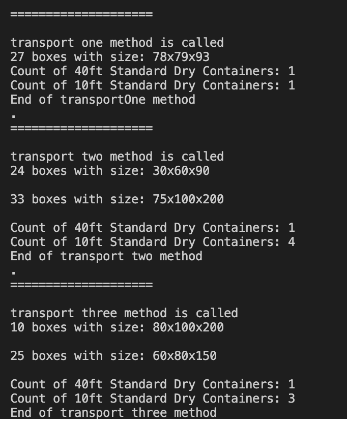

<h1 align="center">Cargo puzzle master</h1>
<br>


INSTALLATION
------------

Project uses [composer](http://getcomposer.org/download/) for the dependencies installation.

Once composer is installed, run:

```bash
composer install
```

Unit tests
------------

To verify the application’s functionality and correctness, run the unit tests.


```bash
./vendor/bin/phpunit 
```

<p>
    
    <br>
    <em>Example</em>
</p>
